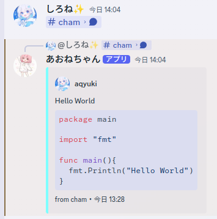

<h1 align="center">📖 README</h1>

FelmはDiscordで送信されたメッセージへのリンクを展開するBotです｡

<h2>✨ Features</h2>

<div align="center"></div>

FelmはDiscordのテキストチャットに送信されたメッセージリンクのうち
同一サーバーかつNSFWチャンネルでないチャンネルに送信されたメッセージを対象に展開し､もとのメッセージにリプライします｡

<h2>🚀 Deployment</h2>

>[!IMPORTANT]
>Felmは現在Docker経由でのデプロイのみ公式にサポートしています｡

`docker compose`コマンドが使用できることを確認してください｡

>[!WARNING]
>docker compose v1は現在非推奨となっています｡ \
>[公式ドキュメント](https://docs.docker.com/compose/releases/migrate/)をもとにdocker compose v2を使用してください｡

以下の内容の`compose.yml`を作成した後､`.env`ファイルにて必要な環境変数を指定してください｡

```yaml
services:
  bot:
    container_name: felm
    image: ghcr.io/aqyuki/felm:latest
    env_file:
      - .env
    restart: unless-stopped
```

`.env`で指定することができる環境変数は次のとおりです｡

| 環境変数名     | 内容                                     | 既定値 | 必須  |
| :------------- | :--------------------------------------- | :----: | :---: |
| `FELM_TOKEN`   | Discord Botのトークンを指定してください｡ |  ---   |   ○   |
| `FELM_TIMEOUT` | ハンドラーのタイムアウトを設定できます｡  |   5s   |       |

<h2>📄 Licese</h2>

**このプロジェクトは､MITライセンスのもとで公開されています｡ライセンスの概要は[License.txt](./License.txt)を確認してください｡
また､このプロジェクトで利用しているOSSのライセンス等は[NOTICE.md](./NOTICE.md)を参照してください｡**
